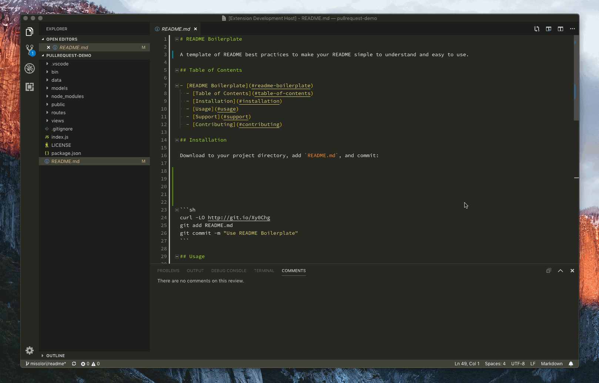

# VS Code Grading Feedback Extension

A VS Code extension that uses the Comments API to easily create, reuse and manage grading feedback on code assignments.

## Origianl Commenting API Example

Code was started from VS Code's extension [example on using the Comments API](https://github.com/microsoft/vscode-extension-samples/tree/main/comment-sample)

This sample shows

- How to create a comment controller.
- How to support comment thread creation for documents.
- How to update comment actions dynamically.

## Running the Sample

- Run `npm install` in terminal to install dependencies
- Run the `Run Extension` target in the Debug View. This will:
	- Start a task `npm: watch` to compile the code
	- Run the extension in a new VS Code window
